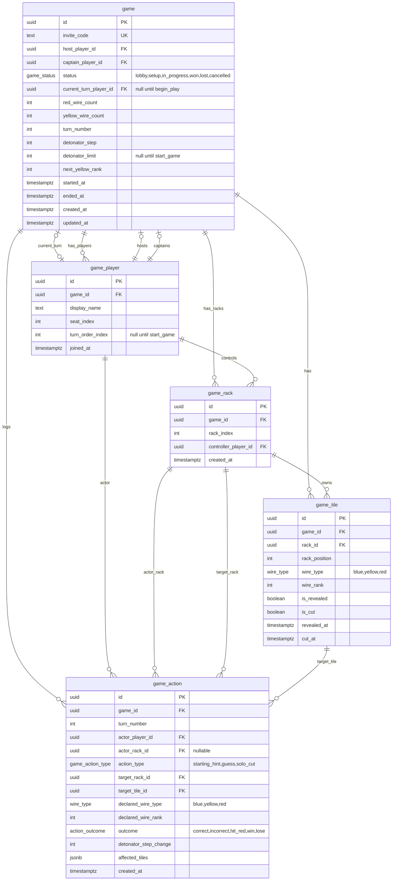

# Bomb Busters

An online multiplayer implementation of the Bomb Busters cooperative deduction board game.
Players work together in real time to cut matching wire tiles and defuse a bomb before the
countdown reaches zero -- without being able to see each other's tiles.

Cross-platform single-page application that runs on desktop and mobile browsers.

## About the Game

Bomb Busters is a cooperative deduction game for 2-5 players. Each session takes roughly
15-30 minutes.

### Components

The game uses three types of wire tiles:

- **Blue wires** (48 tiles): numbered 1-12, four copies each. Standard wires that are cut
  by correctly guessing their number.
- **Yellow wires** (up to 11 tiles): numbered 1.1-11.1, one copy each. Must be announced as
  "yellow" when cut, and must be cut in a specific order.
- **Red wires** (up to 11 tiles): numbered 1.5-11.5, one copy each. Cannot be cut. Targeting
  a red wire ends the game immediately.

Additional components include a detonator/countdown track and hint tokens.

### Setup

Wire tiles are shuffled and dealt face-down. Each player arranges their tiles in ascending
order in a personal rack that only they can see. At the start of the game, each player
provides one hint: the exact number of a single tile in their hand.

### Gameplay

On your turn, point to a specific tile in a teammate's rack and declare a number:

- **Correct guess**: both players reveal all matching tiles, which are placed in the "cut"
  zone.
- **Incorrect guess**: the targeted tile's actual number is revealed and the detonator
  advances one step toward detonation.
- **Solo cut**: if you hold the last two copies of any number, you may cut both without
  guessing.

### Wire Type Rules

- **Blue wires**: standard guessing rules as described above.
- **Yellow wires**: you must declare "yellow" instead of a number. Yellow wires must be cut
  in ascending order (lowest first).
- **Red wires**: cannot be cut. If any player points at a tile that turns out to be a red
  wire, the game is lost immediately.

### Winning and Losing

- **Win**: cut all non-red wire tiles before the countdown reaches zero.
- **Lose**: the countdown reaches zero, or any player targets a red wire.

### Player Count

The game supports 2-5 players. With fewer players, each player holds more tiles and has
more information. With more players, additional starting hints help compensate for the
reduced per-player information.

## Features

### MVP

- Real-time multiplayer game sessions with 2-5 players
- Invite players via QR code
- Setup screen with game configuration (number of players, number of red/yellow wires)
- Core game loop with blue, yellow, and red wire rules
- Interactive tile racks with guess mechanics
- Detonator/countdown board visualization
- Turn-based flow with guess resolution and tile reveals
- Solo cut detection and execution
- Win/loss condition detection
- Starting hint system

### Planned

- Character selection with Double Detector ability (point at two tiles, succeed if either
  matches)
- Equipment card system with unlockable abilities (penalty-free guesses, tile swaps,
  dual-number guesses, free hints)
- 66 scenario definitions with progressive unlocks
- Persistent player accounts and progression tracking
- Spectator mode
- Game history and statistics
- Reconnection handling for dropped connections
- Sound and animation feedback

## Tech Stack

| Layer       | Technology                                                     |
|-------------|----------------------------------------------------------------|
| Language    | TypeScript                                                     |
| Frontend    | React (single-page application)                                |
| Styling     | Tailwind CSS                                                   |
| Backend     | Supabase (PostgreSQL, Realtime, Edge Functions)                |
| Hosting     | GitHub Pages                                                   |
| QR Codes    | QR code generation library (e.g. `qrcode.react`)              |
| Dev Setup   | Docker dev container (Node + Supabase local)                   |

### Architecture

The application is a static React SPA hosted on GitHub Pages with Supabase providing all
backend services. There is no custom server.

**Game state** lives in Supabase PostgreSQL. All game actions (starting hints, guesses, solo
cuts) are processed by Supabase Edge Functions, which act as the authoritative game engine.
Clients never directly modify game state -- they call Edge Functions, which validate the
action and update the database.

**Hidden information** is enforced by the backend data-access layer. The schema assumes a
game-scoped player identity, so clients should only receive hidden tiles for the
`game_player` they control. Publicly visible state (cut tiles, detonator position, whose
turn it is, revealed tile values) is readable by all players in the game.

**Real-time synchronization** uses Supabase Realtime channels. When the Edge Function updates
game state, all connected clients receive the changes via their Realtime subscription and
re-render accordingly.

**Invites** work by generating a URL containing the game invite code. This URL is encoded as
a QR code that other players scan to join.

## Database Schema (MVP)



### Enum Types

| Enum | Used By | Values |
|---|---|---|
| `game_status` | `game.status` | `lobby`, `setup`, `in_progress`, `won`, `lost`, `cancelled` |
| `wire_type` | `game_tile.wire_type`, `game_action.declared_wire_type` | `blue`, `yellow`, `red` |
| `game_action_type` | `game_action.action_type` | `starting_hint`, `guess`, `solo_cut` |
| `action_outcome` | `game_action.outcome` | `correct`, `incorrect`, `hit_red`, `win`, `lose`, `NULL` for `starting_hint` |
| `affected_tile_effect` (JSON value) | `game_action.affected_tiles[].effect` | `targeted`, `revealed`, `cut` |

### Notes

- `game` stores lobby, setup, and in-game runtime state.
- `game_player` is a per-game identity row. Joining a different game creates a different
  `game_player`.
- `game.red_wire_count` and `game.yellow_wire_count` are the only host-configurable lobby
  settings in MVP.
- `game.captain_player_id` is always set and determines who starts first.
- `game.current_turn_player_id` makes turn flow player-based, not rack-based.
- `game_rack` allows one player to control multiple racks in the same game.
- `game_player.turn_order_index` is assigned during `start_game`; non-captain players are
  randomized and the captain always gets `0`.
- Rack allocation is derived from joined player count: 2 players = 2 racks each, 3 players
  = captain gets 2 racks, 4-5 players = 1 rack each.
- Starting hints are per rack, not per player.
- `game_action` is a lightweight immutable action log. `starting_hint` actions leave
  `outcome` as `NULL`.
- `game_action.affected_tiles` shape: `[{"tile_id":"uuid","effect":"targeted|revealed|cut"}]`.

## Getting Started

### Prerequisites

- Docker
- VS Code with the Dev Containers extension (recommended)

### Development Setup

The project uses a Docker-based dev container that includes Node.js and a local Supabase
stack.

```bash
# Clone the repository
git clone git@github.com:whme/bomb-buster.git
cd bomb-buster

# Open in VS Code -- it will prompt to reopen in the dev container
code .

# Or start the dev container manually
devcontainer up
```

Once inside the dev container:

```bash
# Start the local Supabase stack
supabase start

# Install dependencies
npm install

# Start the React dev server
npm run dev
```

The React dev server runs at `http://localhost:5173`. The local Supabase dashboard is
available at `http://localhost:54323`.

### Testing

```bash
npm test
```

### Building for Production

```bash
npm run build
```

The build output in `dist/` is deployed to GitHub Pages.

## Project Structure

```
bomb-buster/
├── .devcontainer/
│   ├── devcontainer.json       # Dev container configuration
│   └── docker-compose.yml      # Node + Supabase services
├── supabase/
│   ├── migrations/             # Database schema and RLS policies
│   ├── functions/              # Edge Functions (game engine)
│   │   ├── guess/              # Process a guess action
│   │   ├── solo-cut/           # Process a solo cut action
│   │   ├── create-game/        # Create a new game session
│   │   ├── join-game/          # Join an existing session
│   │   └── start-game/         # Deal tiles and start the game
│   ├── seed.sql                # Development seed data
│   └── config.toml             # Supabase local configuration
├── src/
│   ├── components/
│   │   ├── Lobby/              # Game creation, QR invite, player list
│   │   ├── Setup/              # Game configuration (wire counts, players)
│   │   ├── Board/              # Main game board, detonator track
│   │   ├── TileRack/           # Player tile racks with interaction
│   │   └── GameOver/           # Win/loss screen
│   ├── hooks/
│   │   ├── useGame.ts          # Game state subscription and actions
│   │   └── useSupabase.ts      # Supabase client singleton
│   ├── lib/
│   │   ├── supabase.ts         # Supabase client initialization
│   │   └── game.ts             # Client-side game logic helpers
│   ├── types/
│   │   └── game.ts             # TypeScript type definitions
│   ├── App.tsx                 # Root component and routing
│   └── main.tsx                # Entry point
├── public/
├── index.html
├── package.json
├── tsconfig.json
├── vite.config.ts
├── tailwind.config.ts
├── .gitignore
└── README.md
```

## Roadmap

### Phase 1 -- MVP

- [x] Project scaffolding (React + Vite + Tailwind + Supabase)
- [x] Dev container setup (Docker with Node + Supabase local)
- [x] Supabase database schema and Row Level Security policies
- [ ] Edge Functions for game actions (create, join, start, guess, solo cut)
- [x] Lobby UI (create game, QR code invite, player list, ready state)
- [x] Setup screen (configure player count, red/yellow wire counts)
- [ ] Game board UI (tile racks, detonator track, turn indicator)
- [ ] Real-time state synchronization via Supabase Realtime
- [ ] Blue, yellow, and red wire rule enforcement
- [ ] Starting hint system
- [ ] Win/loss detection and game-over screen
- [ ] GitHub Pages deployment

### Phase 2 -- Characters and Equipment

- [ ] Character card selection at game start
- [ ] Double Detector ability implementation
- [ ] Equipment card deck and unlock triggers
- [ ] Equipment abilities (penalty-free guess, tile swap, dual guess, free hint)

### Phase 3 -- Scenarios and Progression

- [ ] Scenario definition format
- [ ] Training scenarios (8) and advanced scenarios (58)
- [ ] Persistent player accounts via Supabase Auth
- [ ] Progression tracking and content unlocks

### Phase 4 -- Polish

- [ ] Reconnection handling for dropped players
- [ ] Spectator mode
- [ ] Game history and statistics
- [ ] Mobile-optimized layout and touch interactions
- [ ] Sound effects and animations
- [ ] Accessibility improvements

## Contributing

Contributions are welcome. Please open an issue to discuss proposed changes before
submitting a pull request.

## License

TBD
